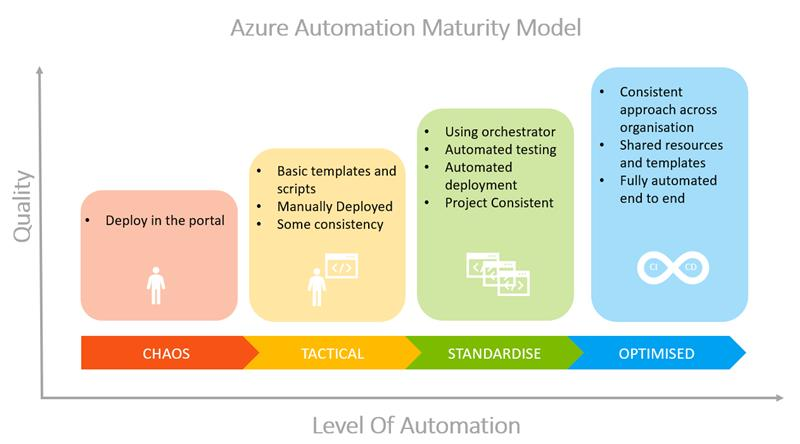

# FastTrack for Azure - How to deploy Azure service and infrastructure using ARM Template. Leverage Azure Pipeline for continuous deployment.  

## Synopsis:
"Zero to Hero with ARM and IaC" How to create an ARM Template from scratch and deploy it using CI/CD pipelines.

## Who should attend:
- I want to do Infrastructure as Code but don't know where to start.
- My team keeps asking me to deploy infrastructure and various environments to Azure, and I do it manually.
- I want to automate my infrastructure.

## At the end of the session you should:
- Understand the basic structure of an ARM Template
- Be aware of the tools available to create and manage ARM Templates
- Understand basic how to create and use simple Azure Pipelines

## What are prerequisites:
- Azure Subscription
- Azure DevOps account
- JSON (JavaScript Object Notation)
- YAML Syntax
- Git repository
- Desire to learn

## Where are your team

## About this sample
This sample is a guide for learning basic ARM Template usage. The links in this document can you help better understand these services and tools.

## [What is Infrastructure as Code?](https://docs.microsoft.com/en-us/azure/devops/learn/what-is-infrastructure-as-code)

## Azure Resource Manager (ARM) Template
A native infra-as-code solution for managing Azure resources using a declarative programming paradigm.

### Concepts
- [What is ARM?](https://docs.microsoft.com/en-us/azure/azure-resource-manager/management/overview)
- [What are ARM Templates?](https://docs.microsoft.com/en-us/azure/azure-resource-manager/templates/overview)
- [Nested and Linked templates](https://docs.microsoft.com/en-us/azure/azure-resource-manager/templates/linked-templates)
- [Deployment modes](https://docs.microsoft.com/en-us/azure/azure-resource-manager/templates/deployment-modes)
- [Best practices](https://docs.microsoft.com/en-us/azure/azure-resource-manager/templates/template-best-practices)    

### Authoring tools and helps
- [ARM QuickStart Templates](https://azure.microsoft.com/en-us/resources/templates/)
- [Azure Portal](https://docs.microsoft.com/en-us/azure/azure-resource-manager/templates/quickstart-create-templates-use-the-portal)
- [VS Code](https://docs.microsoft.com/en-us/azure/azure-resource-manager/templates/quickstart-create-templates-use-visual-studio-code?tabs=CLI)
- [Visual Studio](https://docs.microsoft.com/en-us/azure/azure-resource-manager/templates/create-visual-studio-deployment-project)
- [Template structure and syntax](https://docs.microsoft.com/en-us/azure/azure-resource-manager/templates/template-syntax)
- [Template references](https://docs.microsoft.com/en-us/azure/templates/)
- [ARM template functions](https://docs.microsoft.com/en-us/azure/azure-resource-manager/templates/template-functions)
- [What-if deployment (preview)](https://docs.microsoft.com/en-us/azure/azure-resource-manager/templates/template-deploy-what-if?tabs=azure-powershell)
- [Deployment scripts (preview)](https://docs.microsoft.com/en-us/azure/azure-resource-manager/templates/deployment-script-template?tabs=CLI)
- [ARM Template Toolkit for analyzing and testing](https://github.com/Azure/arm-ttk)

### Tutorials
- [Azure Pipelines and ARM template](https://docs.microsoft.com/en-us/azure/azure-resource-manager/templates/add-template-to-azure-pipelines)

## Other orchestrators
### Terraform with Azure
- [Overview](https://docs.microsoft.com/en-us/azure/developer/terraform/overview)
- [Terraform QuickStart](https://docs.microsoft.com/en-us/azure/developer/terraform/install-configure)
- [Terraform Configuration Language](https://www.terraform.io/docs/configuration/syntax.html)
- [Store Terraform state in Azure Storage](https://docs.microsoft.com/en-us/azure/developer/terraform/store-state-in-azure-storage)
- [Automating infrastructure deployments in the Cloud with Terraform and Azure Pipelines](https://www.azuredevopslabs.com/labs/vstsextend/terraform/)

### Ansible wiht Azure
- [Overview](https://docs.microsoft.com/en-us/azure/developer/ansible/overview)
- [Ansible QuickStart](https://docs.microsoft.com/en-us/azure/developer/ansible/install-on-linux-vm)  
- [Ansible Playbooks](https://docs.ansible.com/ansible/latest/user_guide/playbooks_intro.html)
- [Automating infrastructure deployments in the Cloud with Ansible and Azure Pipelines](https://www.azuredevopslabs.com/labs/vstsextend/ansible/)

## [FAQ](./faq.md)
